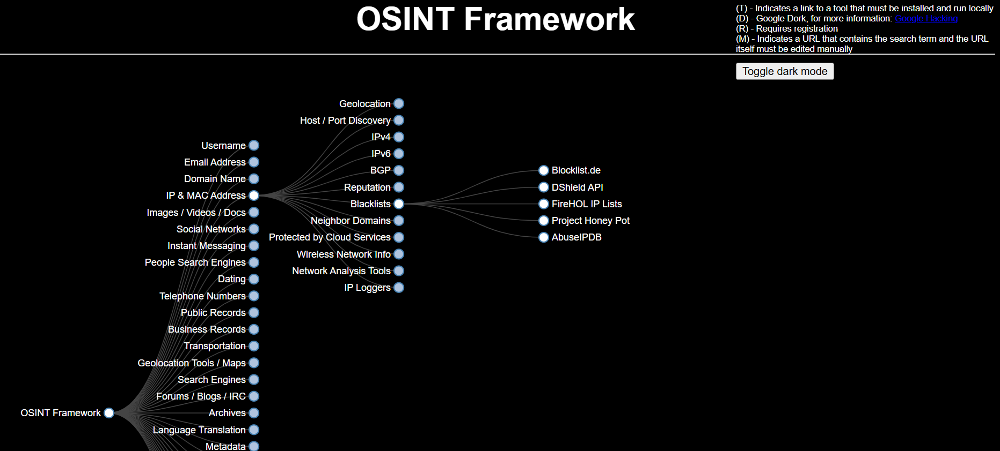
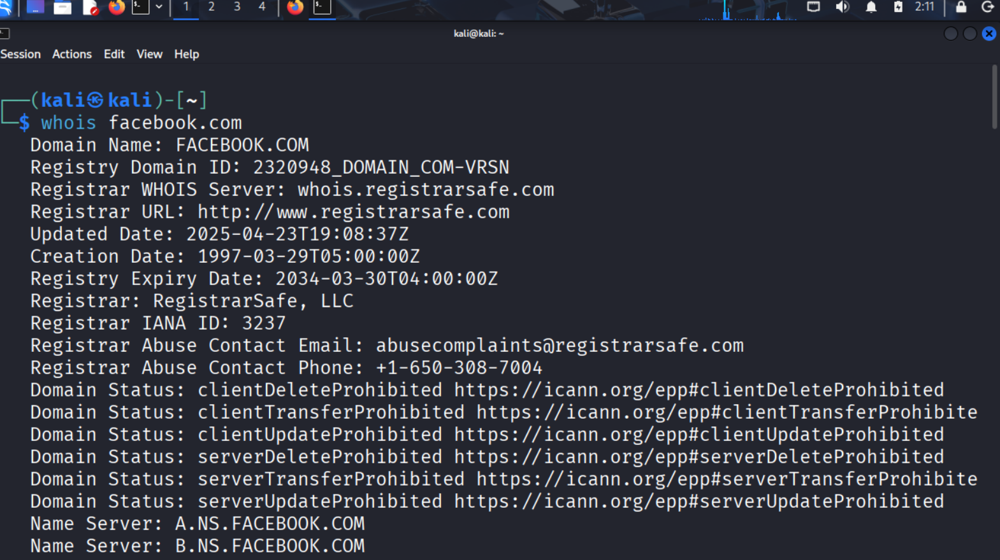
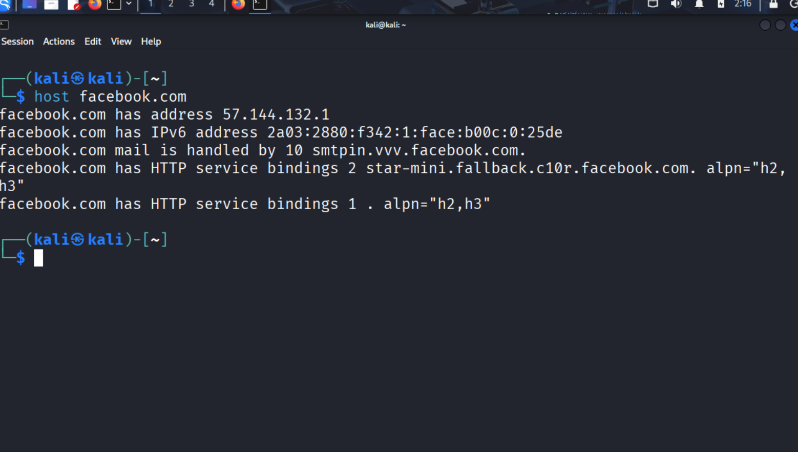
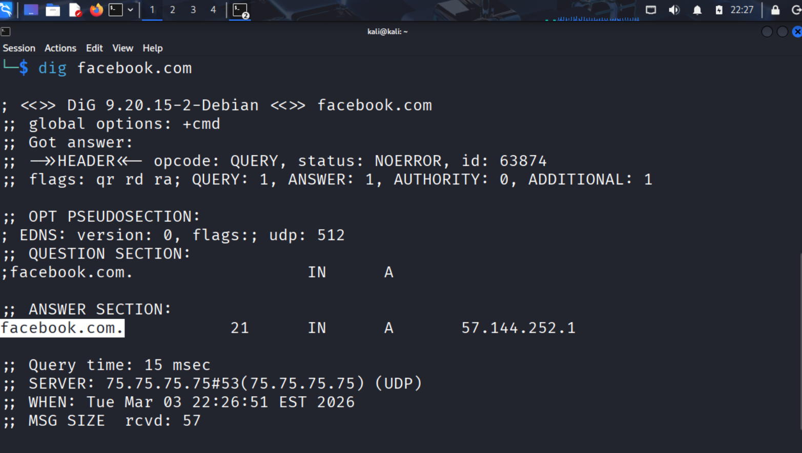
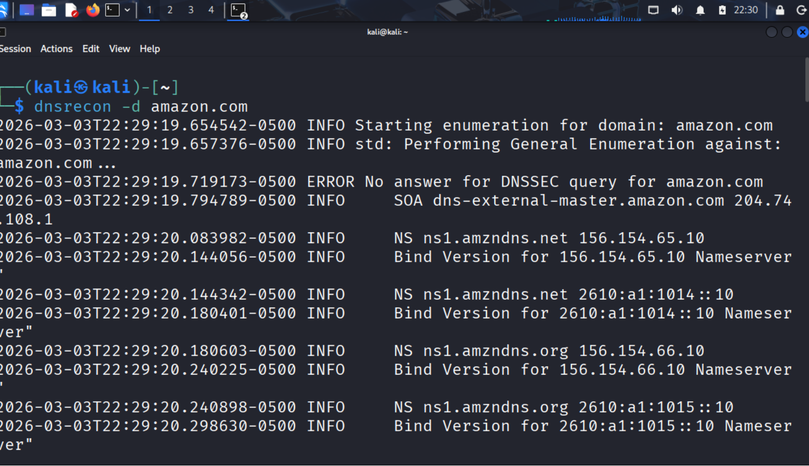
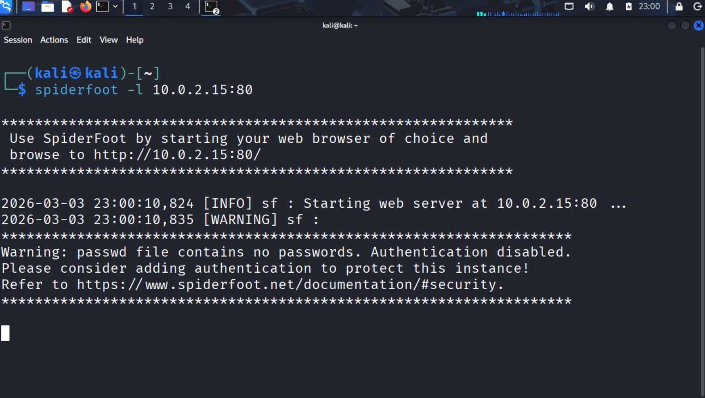
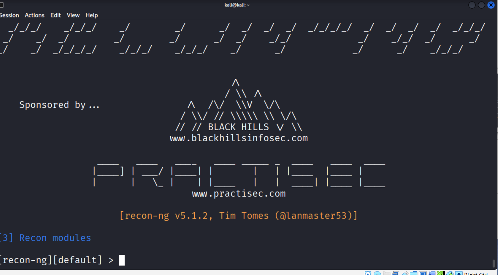

# PASSIVE-RECONNAISSANCE-AND-OSINT-COLLECTION-FOR-VULNERABILITY-ASSESSMENT

# Overview

This project demonstrates the passive reconnaissance phase of a vulnerability assessment, focusing on collecting publicly available intelligence about a target domain without directly interacting with the target infrastructure.

Passive reconnaissance is a critical stage in security assessments because it allows analysts to identify potential attack surfaces, infrastructure dependencies, and domain exposure while avoiding active network probing.

The objective of this exercise was to perform structured OSINT collection and DNS intelligence analysis using industry-standard reconnaissance tools available in Kali Linux.

# The project focuses on identifying:

- Domain registration intelligence

- DNS infrastructure records

- Mail server configuration

- Hosting and IP associations

- Publicly exposed domain metadata
  

The collected intelligence provides foundational insight for later stages of vulnerability analysis and attack surface mapping.

# Reconnaissance Methodology: The reconnaissance process followed a structured approach:

- Open Source Intelligence (OSINT) discovery

- Domain registration analysis

- DNS record enumeration

- Infrastructure and mail server identification

- Automated reconnaissance aggregation
  

All activities were conducted using passive reconnaissance techniques, meaning no direct interaction with the target infrastructure occurred.

# Tools and Techniques

The following tools were used during the reconnaissance process.

# 1. OSINT Framework

The OSINT Framework was used as the initial intelligence gathering resource.

OSINT Framework is a curated collection of reconnaissance tools and data sources used for gathering publicly available intelligence.

It provides structured access to multiple intelligence categories including:

- Domain intelligence

- DNS records

- Network infrastructure

- Email and identity data

- Public breach data

- Certificate transparency logs
  

Using the framework allows analysts to identify relevant intelligence sources before performing deeper technical enumeration.

### Screenshot

# 2. WHOIS – Domain Registration Intelligence

The whois utility was used to retrieve domain registration metadata.

WHOIS provides key information about domain ownership and registration records including:

- Domain creation date

- Domain expiration date

- Domain registrar

- Registrar URL

- Domain status

- Name servers
  

This information helps analysts determine:

- Domain age and lifecycle

 -Infrastructure ownership patterns

 -Potential hosting providers
 

### Example Command

whois targetdomain.com

### Screenshot

# 3. Host – DNS Record Identification

The host command was used to perform DNS lookups and identify infrastructure details associated with the domain.

This tool provides quick visibility into:

- Domain IP address mapping

- Mail Exchange (MX) records

- DNS hosting providers

- Name server information

DNS record identification is important because it reveals supporting infrastructure used by the organization.

### Example Command

host targetdomain.com

### Screenshot

# 4. Dig – Deep DNS Enumeration

The Dig (Domain Information Groper) tool was used to perform deeper DNS analysis.

Dig provides detailed DNS responses that allow analysts to enumerate:

- A Records – IP address mapping

- MX Records – mail servers

- NS Records – authoritative name servers

- TXT Records – security policies

- DNS configuration details

Understanding DNS architecture is critical because it exposes supporting services and infrastructure dependencies.

### Example Command

dig targetdomain.com

### Screenshot

# 5. DNSrecon – Domain Record Enumeration

DNSrecon was used to collect additional domain-related intelligence and enumerate domain record types.

- It helps identify:

- DNS records

- A records

- MX records

- TXT records

- DMARC records
  

DMARC and TXT records often reveal email authentication mechanisms, which can indicate security posture or misconfigurations.

### Screenshot

# 6. SpiderFoot – Automated OSINT Aggregation

SpiderFoot is an automated reconnaissance platform that aggregates intelligence from multiple OSINT sources.

It is used to perform comprehensive intelligence collection including:

- DNS records

- IP infrastructure

- Domain relationships

- Email addresses

- Subdomain discovery

- Network exposure indicators
  

SpiderFoot consolidates data from multiple modules, providing a broader intelligence view of the target's digital footprint.

### Screenshot

# 7. Recon-ng – OSINT Reconnaissance Framework

Recon-ng is a modular reconnaissance framework used for structured intelligence gathering.

It provides a command-driven environment similar to penetration testing frameworks and allows analysts to run reconnaissance modules for various intelligence sources.

### Capabilities include:

- Domain intelligence gathering

- Subdomain enumeration

- Contact discovery

- Infrastructure mapping

- Data correlation
  

Recon-ng helps organize reconnaissance activities and automate data collection workflows.

### Screenshot

## Key Security Insights

Passive reconnaissance revealed that significant information about a domain’s infrastructure can be obtained through publicly available data sources.

## Key observations include:

- DNS records expose infrastructure architecture

- Domain registration data reveals lifecycle and hosting relationships

- Mail server records indicate communication infrastructure

- OSINT aggregation tools provide extensive intelligence from multiple sources
  

Understanding these data points helps security analysts identify potential attack surfaces and infrastructure exposure before active scanning begins.

# Security Relevance

Passive reconnaissance plays an important role in the vulnerability management lifecycle because it helps security teams:

- Map external attack surfaces

- Identify exposed infrastructure

- Understand domain ownership and hosting relationships

- Detect misconfigured DNS or email security policies
  

This intelligence forms the foundation for deeper vulnerability analysis, asset discovery, and risk assessment.

## Disclaimer

This project was conducted strictly for educational and professional development purposes within a controlled lab environment. No unauthorized reconnaissance or scanning activities were performed against systems without permission
